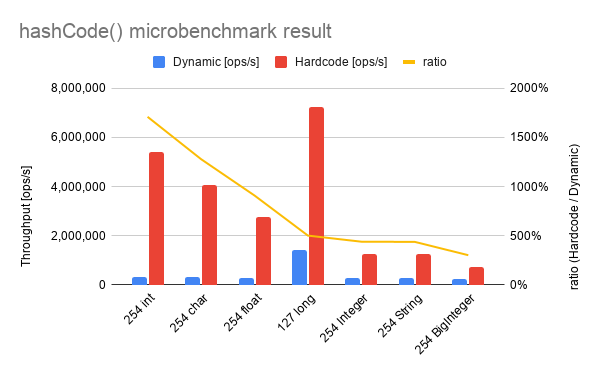

# Java 16 Record performance benchmark 

Purpose: Grasp the characteristic of dynamically generated methods in record classes like `equals(Object)` in the performance perspective.

## How to run the benchmark

```shell
$ mvn clean verify
$ java -jar target/benchmarks.jar
```

## Benchmark result in local

```
$ mvn -v
Java version: 16, vendor: Oracle Corporation, runtime: /Users/kengo/Library/Java/JavaVirtualMachines/openjdk-16/Contents/Home
```
```
# Run complete. Total time: 00:52:40

REMEMBER: The numbers below are just data. To gain reusable insights, you need to follow up on
why the numbers are the way they are. Use profilers (see -prof, -lprof), design factorial
experiments, perform baseline and negative tests that provide experimental control, make sure
the benchmarking environment is safe on JVM/OS/HW level, ask for reviews from the domain experts.
Do not assume the numbers tell you what you want them to tell.

Benchmark                                               Mode  Cnt          Score         Error  Units
RecordHashcodeBenchmark.run127longDynamic              thrpt   25    1437877.993 ±   67782.878  ops/s
RecordHashcodeBenchmark.run127longHardcode             thrpt   25    7223368.762 ±   10012.090  ops/s
RecordHashcodeBenchmark.run1intDynamic                 thrpt   25  495199305.946 ± 1111537.820  ops/s
RecordHashcodeBenchmark.run1intHardcode                thrpt   25  494756582.694 ±  610230.961  ops/s
RecordHashcodeBenchmark.run254BigIntDynamic            thrpt   25     242491.087 ±    2063.087  ops/s
RecordHashcodeBenchmark.run254BigIntHardcode           thrpt   25     734847.501 ±    4699.389  ops/s
RecordHashcodeBenchmark.run254IntegerDynamic           thrpt   25     283506.667 ±    5653.954  ops/s
RecordHashcodeBenchmark.run254IntegerHardcode          thrpt   25    1248434.073 ±    2503.341  ops/s
RecordHashcodeBenchmark.run254StringDynamic            thrpt   25     284173.235 ±    2679.667  ops/s
RecordHashcodeBenchmark.run254StringHardcode           thrpt   25    1245834.439 ±    9987.994  ops/s
RecordHashcodeBenchmark.run254charDynamic              thrpt   25     318567.725 ±    1034.152  ops/s
RecordHashcodeBenchmark.run254charHardcode             thrpt   25    4078077.505 ±    9570.897  ops/s
RecordHashcodeBenchmark.run254floatDynamic             thrpt   25     301409.729 ±    4035.105  ops/s
RecordHashcodeBenchmark.run254floatHardcode            thrpt   25    2743754.442 ±   15684.091  ops/s
RecordHashcodeBenchmark.run254intDynamic               thrpt   25     315060.236 ±    3940.025  ops/s
RecordHashcodeBenchmark.run254intHardcode              thrpt   25    5388902.330 ±    6374.034  ops/s
RecordHashcodeBenchmark.run254intHardcodeMethodAccess  thrpt   25    5389934.628 ±    3993.995  ops/s
```

### Windows 10 (adoptopenjdk 16+36)

```
Benchmark                                               Mode  Cnt           Score           Error  Units
RecordHashcodeBenchmark.run1intDynamic                 thrpt   25  1743843753.226 ±  51586692.872  ops/s
RecordHashcodeBenchmark.run1intHardcode                thrpt   25  1772637842.250 ± 110599755.291  ops/s
RecordHashcodeBenchmark.run254BigIntDynamic            thrpt   25      178008.001 ±     26359.409  ops/s
RecordHashcodeBenchmark.run254BigIntHardcode           thrpt   25      689576.898 ±     30282.948  ops/s
RecordHashcodeBenchmark.run254intDynamic               thrpt   25      272436.073 ±     15712.528  ops/s
RecordHashcodeBenchmark.run254intHardcode              thrpt   25     4603760.043 ±    283529.753  ops/s
RecordHashcodeBenchmark.run254intHardcodeMethodAccess  thrpt   25     4142983.273 ±    433618.323  ops/s
RecordHashcodeBenchmark.run254IntegerDynamic           thrpt   25      241394.516 ±     12118.429  ops/s
RecordHashcodeBenchmark.run254IntegerHardcode          thrpt   25     1159884.408 ±     31671.672  ops/s
RecordHashcodeBenchmark.run254StringDynamic            thrpt   25      250901.281 ±     10335.595  ops/s
RecordHashcodeBenchmark.run254StringHardcode           thrpt   25     1053330.519 ±     38281.115  ops/s
RecordHashcodeBenchmark.run254floatDynamic             thrpt   25      276144.426 ±     24828.927  ops/s
RecordHashcodeBenchmark.run254floatHardcode            thrpt   25     2438602.292 ±     78774.529  ops/s
```


